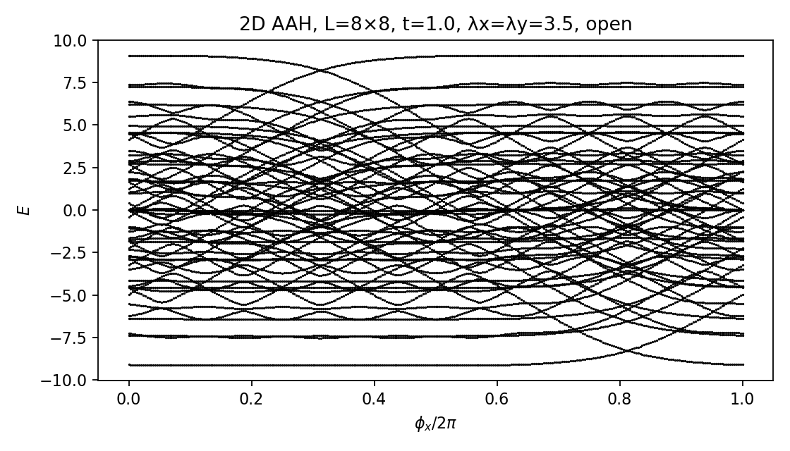

# 2D Hermitian Aubry–André–Harper (AAH) Model

This repository contains a **minimal, safe-to-share implementation** of the **2D Hermitian Aubry–André–Harper model**.  
It builds the tight-binding Hamiltonian on an $L_x \times L_y$ lattice, diagonalizes it, and plots the energy spectrum $E$ as a function of the modulation phase $\phi_x$.

---

## What is implemented?

- A real-symmetric Hamiltonian  
  $H \in \mathbb{R}^{(L_x L_y) \times (L_x L_y)}$  

- Onsite potential that depends on both lattice directions:  
  $
  V(x,y) = \lambda_x \sin(2\pi \alpha_x x + \phi_x)
         + \lambda_y \sin(2\pi \alpha_y y + \phi_y)
  $

- Nearest-neighbor hopping on a 2D square grid  
- Open boundary conditions (easy to modify if you want periodic)  
- Fast diagonalization using `numpy.linalg.eigh`  
- Simple plotting routine: spectrum $E$ vs $\phi_x$

---

## Example Output

Running the demo script will generate a plot of the energy bands vs $\phi_x$, e.g.:


---

## How to run

Clone the repo and install dependencies:

```bash
git clone https://github.com/<your-username>/2D-Hermitian-AAH-model.git
cd 2D-Hermitian-AAH-model
pip install -r requirements.txt


